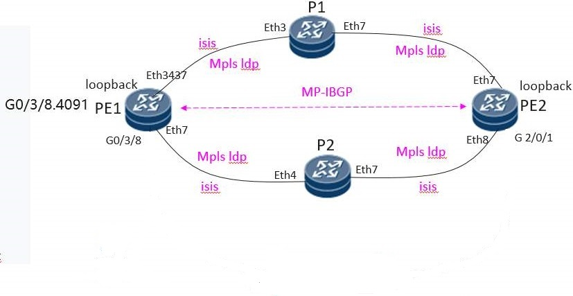

#VPN-service-example

## **Background**

This example is designed to show how to configure a vpn service on Huawei NE8000 router via Ansible.
Huawei NE8000 router hasn't provided Ansible APIs, so we will design our customized Ansible APIs 
and use ansible-gen tool to generated them and deploy them to ansible framework automatically.

The topology is shown below:

We will create a vpn service between PE1 and PE2. In this example, we only show how to configure PE1. 

## Procedure

- [ ] install ansible 2.9.0

​        `pip install ansible==2.9.0`

- [ ] install ne-ansible-plugin

​       following the README.md at https://github.com/HuaweiDatacomm/ne-ansible-plugin

- [ ] install ansible-gen

  `pip install ansible-gen`

- [ ] obtain Yang modules

  Visit https://github.com/Huawei/yang/tree/master/network-router/8.20.10/ne8000-m8
  and download yang files.

  the downloaded yang files in [here](https://github.com/HuaweiDatacomm/ansible-gen-examples/tree/main/vpn-service-example/yang).

- [ ] edit Ansible API description XML files

  - Option 1: get xml templates by xml-translator (it’s a function provided by Huawei router),and modify the template.
  - Option 2: visit [https://intl.devzone.huawei.com/en/datacom/network-element/api-center.html](https://intl.devzone.huawei.com/en/datacom/network-element/api-center.html)  and find suitable version 

  ​                  YANG API reference. E.g. VRP 8.20.10   NE8000-M8, and get the example request and modify it.

  the edited API description files are documented in [here](https://github.com/HuaweiDatacomm/ansible-gen-examples/tree/main/vpn-service-example/api_desc).

- [ ] clone ansible-gen-examples project

  `git clone https://github.com/HuaweiDatacomm/ansible-gen-examples.git`

- [ ] run ansible-gen command

  `cd vpn-service-example`

  `ansible-gen -y yang -r api_desc`

  ansible-gen will generate your customized Ansible APIs according to YANG modules and your API description files, and copy them to ansible framework.

  you can find them in ${ANSIBLE_PATH}/modules/network/ne directory.

  And we have documented them in [here](https://github.com/HuaweiDatacomm/ansible-gen-examples/tree/main/vpn-service-example/apis).

- [ ] wrtie playbook and run it at ansible

  

  

